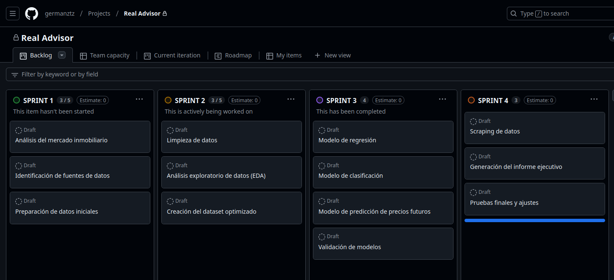

# Real Advisor

Descubre las mejores oportunidades inmobiliarias en Barcelona con nuestro sistema de recomendación. Analiza datos clave, estima rentabilidad y riesgos, y recibe informes detallados para decisiones inteligentes.

## Objeto

El objetivo principal del trabajo es desarrollar un sistema **recomendador de inversiones** en el sector inmobiliario. En el ámbito terrorial de la **provincia de Barcelona**.

El sistema solicitará al usuario una serie de datos para realizar el análisis, como:
- Datos o URL del imnueble (precio de compra, m2, ubicación)
- Otras características del inmueble (número de habitaciones, superficie, etc.) **(fuera del alcance)**

El sistema podrá estimar el importe de alquiler de esa vivienda teniendo en cuenta el municipio, la superficie y demás características del inmueble
Como resultado, el sistema devolverá un informe comercial del inmuebles analizado según el riesgo y la rentabilidad estimada y otros factores.

## Alcance

1. **Investigación**: Se llevará a cabo una investigación exploratoria para comprender el mercado inmobiliario y las tendencias actuales, precios del mercado inmobiliario de Barcelona.

   - Listado de Entidades gubernamentales para obtención datos sobre el mercado inmobiliario
   - Listado de portales inmobiliarios para obtención de datos de oferta de venta

1. **Analisis**: Se analizarán los datos de oferta de venta de inmuebles y alquileres


   1. **Análisis de Series de Tiempo**: Realizar un análisis exhaustivo de las tendencias y patrones temporales presentes en los datos.
   2. **Análisis Exploratorio de Datos (EDA)**: Identificar patrones, anomalías y relaciones entre las variables mediante visualizaciones y estadísticas descriptivas.
   3. **Análisis de Calidad de los Datos**: Evaluar la calidad de los datos, identificando problemas como valores faltantes, inconsistencias, errores o duplicados.
   4. **Análisis Gráfico de los Datos**: Representar gráficamente las variables mediante gráficos como histogramas, diagramas de dispersión, boxplots, entre otros, para facilitar la comprensión visual de los datos.
   5. **Segmentación Inteligente de los Datos**: Implementar técnicas de segmentación avanzadas que aporten valor al análisis y la extracción de insights relevantes.
   6. **Análisis de Correlación**: Evaluar las relaciones y asociaciones entre las variables mediante matrices de correlación y análisis de dependencias.
   7. **Análisis de Outliers**: Detectar y tratar los valores atípicos (outliers) presentes en los datos para mejorar la precisión de los modelos.
   8. **Análisis de Cohortes Avanzados**: Realizar segmentación y análisis del comportamiento de los usuarios a lo largo del tiempo, con el objetivo de identificar patrones de retención, uso y otros comportamientos clave.

1. **Modelamiento**: Se desarrollarán modelos de aprendizaje automático (ML) para predecir la rentabilidad futura de una inversión inmobiliaria y el retorno sobre la inversión (ROI).

   9. **Modelos de Regresión Regularizados**: Implementar modelos de regresión regularizados (como Ridge, Lasso, ElasticNet), utilizando técnicas de búsqueda de hiperparámetros para optimizar el rendimiento del modelo.
   10. **Modelos de Clasificación**: Desarrollar y optimizar modelos de clasificación (como árboles de decisión, SVM, k-NN), utilizando los métodos adecuados de validación y evaluación.
   11. **Validación de Modelos**: Seleccionar los mejores modelos mediante validación cruzada con k-fold, para asegurar la robustez y generalización de los modelos creados.
         - Modelo de regresión para interpolación para rellenado de precios faltantes
         - Modelo de clasificación para predecir la ocupación del inmueble
         - Modelo de extrapolación para predicción de precios actuales y futuros
         - Uso de Modelos generativos DDL para interpretar las propiedades

1. **Desarrollo**: Se desarrollarán un sistema de recuperación de información y recomendación de inversiones inmobiliarias basado en los modelos desarrollados.

   12. **Uso de Scraping para Variables Exógenas**: El proyecto debe incluir el uso de técnicas de web scraping para obtener variables adicionales de fuentes externas que aporten valor a los datos originales del proyecto.
         - Scrapping de una web para extraer datos del inmueble necesarios para realizar la valoración de la inversión
   - Generación del informe de valoración de la inversión del inmueble

## Planificación

### Metodología ágil

Para abordar este análisis mediante una metodología ágil, vamos a estructurar el trabajo en iteraciones cortas o "sprints". Cada sprint tendrá una duración de 1 semana, con entregas de valor al final de cada uno para mantener el progreso continuo y asegurar que el equipo se adapta rápidamente a cualquier cambio o mejora que se necesite.

Aquí está el desglose de la metodología ágil aplicada a este proyecto de análisis: fichero adjunto: [planificación](planificación.md)



## Metodología

Para el proyecto del recomendador de inversiones inmobiliarias, el tipo de modelo de machine learning (ML) a utilizar depende de los objetivos específicos de predicción y análisis de riesgo y rentabilidad.

### Tipo de modelo de ML

1. **Regresión**:
   Dado que el objetivo principal es predecir la rentabilidad futura de una inversión inmobiliaria y el retorno sobre la inversión (ROI), el tipo de modelo de ML más adecuado sería un **modelo de regresión**. Este tipo de modelo es utilizado para predecir valores numéricos continuos, como el precio futuro de una propiedad o la tasa de retorno esperada.

   - **Regresión lineal múltiple** podría ser un modelo inicial simple, en el que se utilicen múltiples variables como el precio de compraventa, la localización, el tamaño, el estado del inmueble, y otros factores para predecir la rentabilidad o el precio futuro del inmueble.
   - **Modelos de regresión más avanzados** como **Random Forest Regressor** o **XGBoost Regressor** podrían ser implementados para mejorar la precisión, ya que son modelos no lineales que capturan mejor las interacciones complejas entre las variables.

2. **Clasificación**:
   Además, en ciertos aspectos como la clasificación del nivel de riesgo de una inversión, se podrían usar **modelos de clasificación**. Este tipo de modelo clasifica los inmuebles en categorías de riesgo (por ejemplo, bajo, medio, alto). Modelos como **árboles de decisión** o **logistic regression** serían útiles aquí.

### Métrica de evaluación del modelo

1. **Error cuadrático medio (Mean Squared Error, MSE)**:
   Para los modelos de regresión, una métrica adecuada para medir el rendimiento sería el **MSE**. Esta métrica mide el promedio del cuadrado de los errores (diferencia entre el valor real y el valor predicho). Se prefiere minimizar el MSE para obtener predicciones más precisas.

2. **Error absoluto medio (Mean Absolute Error, MAE)**:
   Otra métrica útil es el **MAE**, que calcula la media de las diferencias absolutas entre las predicciones y los valores reales. Es más interpretativa en ciertos contextos, ya que expresa los errores en las mismas unidades que la variable de interés (precio de inmueble o rentabilidad).

3. **R² (Coeficiente de determinación)**:
   Esta métrica indica qué porcentaje de la variabilidad en los datos se explica por el modelo. Un valor cercano a 1 indica que el modelo es capaz de explicar la mayor parte de la variabilidad en los precios o rentabilidades predichos.

4. **Precisión, Recall y F1-Score** (para clasificación):
   En los modelos de clasificación (para riesgo de inversión), se utilizarían métricas como la **precisión** (qué tan bien el modelo predice correctamente los inmuebles de alto riesgo), **recall** (qué proporción de inmuebles de alto riesgo fueron correctamente clasificados), y **F1-score**, que combina ambas métricas en un solo valor.

### Conclusión
- Para la **predicción de rentabilidad y precios**, un **modelo de regresión** con **MSE** o **MAE** como métrica de evaluación sería adecuado.
- Para la **clasificación de inmuebles por nivel de riesgo**, un modelo de clasificación con métricas como **precisión**, **recall** y **F1-score** proporcionaría información útil para los usuarios interesados en inversiones de bajo o alto riesgo.

Se considerarán las tendencias observadas en los datos históricos y se compararán con los datos actuales extraídos de los portales inmobiliarios. La información será filtrada por municipio y otras características clave de los inmuebles. Además, se analizarán las descripciones de los inmuebles para identificar propiedades ocupadas, alquiladas o con otras condiciones especiales.

Los datos a analizar en el sistema incluirán:
- Precio de compraventa
- Fecha de compraventa
- Municipio
- Código postal
- Tipo de inmueble
- Superficie
- Número de habitaciones
- Número de baños
- Descripción del inmueble
- Estado del inmueble
- Precio de alquiler

## Requisitos

1. Datos estadísticos de compraventa de inmuebles en Cataluña de los últimos años (descargables en archivo)
2. Datos estadísticos de alquiler de viviendas en Cataluña de los últimos años (descargables en archivo)
3. Datos de las ofertas actuales de compraventa de inmuebles en Cataluña extraídos de portales online (web scraping)
4. Datos de las ofertas actuales de alquiler de viviendas en Cataluña (web scraping)
5. Modelo de ML entrenado con los datos de compraventa, alquiler y oferta de inmuebles

## Tareas

1. Estudio de portales y páginas estadísticas gubernamentales de Cataluña y España:
   - Listado de portales candidatos para la obtención de datos
1. Obtención de datos estadísticos de compraventa y alquiler de los últimos años en Cataluña:
   - Múltiples tablas con datos históricos de compraventa
   - Múltiples tablas con datos históricos de alquiler
1. Filtrado y limpieza de los datos:
   - Una única tabla con datos de compraventa optimizados
   - Una única tabla con datos de alquiler optimizados
1. Estudio de datos complementarios (por ejemplo, datos geográficos):
   - Tabla con datos de compraventa completos y optimizados
   - Tabla con datos de alquiler completos y optimizados
1. Identificación de portales inmobiliarios con oferta de venta y alquiler:
   - Listado de portales candidatos para la obtención de datos
1. Web scraping de la oferta actual de inmuebles y alquileres:
   - Scripts de web scraping de oferta de venta de inmueble
   - Scripts de web scraping para diferentes portales **(fuera del alcance)**
   - Múltiples tablas con datos de oferta de venta de inmuebles **(fuera del alcance)**
   - Múltiples tablas con datos de oferta de alquiler de viviendas **(fuera del alcance)**
1. Filtrado, limpieza y completado (por ejemplo, con datos geográficos) de la oferta:
   - Una única tabla con datos de oferta de venta optimizados **(fuera del alcance)**
   - Una única tabla con datos de oferta de alquiler optimizados **(fuera del alcance)**
1. Entrenamiento del modelo de ML con datos de compraventa, alquiler y oferta actual:
   - Modelo de regresión pa interpolación para rellenado de precios faltantes
   - Modelo de clasificación para predecir la ocupación del inmueble
   - Modelo de extrapolación para predicción de precios actuales y futuros
   - Uso de Modelos generativos DDL para interpretar las propiedades1. Realización de predicciones y valoraciones sobre las ofertas
1. Evaluación del modelo
1. Creación del portal web para la recomendación de inversiones inmobiliarias **(fuera del alcance)**


### 1. Listado de portales candidatos para la obtención de datos

- [Sistema estatal de referencia del precio del alquiler de vivienda (SERPAVI)](https://www.mivau.gob.es/vivienda/alquila-bien-es-tu-derecho/serpavi) 

   El SERPAVI ofrece el resultado de la explotación de fuentes tributarias de los datos sobre arrendamientos de vivienda habitual.

- [Barcelona Dades](https://portaldades.ajuntament.barcelona.cat/ca/report/habitatge)

   Anàlisi de l’evolució de la construcció d’habitatges a la ciutat, les compravendes registrades i els preus dels habitatges nous i de segona mà, així com els contractes de lloguer i els preus de lloguers per districtes i barris.

   Ejemplo de uso de la api

   ```bash
   curl -H "X-IBM-Client-Id: ${bcndades_client_id}" -o file.csv "https://portaldades.ajuntament.barcelona.cat/services/backend/rest/statistic/export?id=5ibudgqbrb&fileformat=CSV"
   ```

- [Servei de dades obertes de l'Ajuntament de Barcelona](https://opendata-ajuntament.barcelona.cat/data/es/organization/habitatge)
- [Iniciativa de datos abiertos del Gobierno de España](https://datos.gob.es/es/catalogo?theme_es=Vivienda)
- [Portal de dades obertes de la Generalitat](https://analisi.transparenciacatalunya.cat/browse?category=Habitatge)


---
# 1. Investigación


   ## 1.1 Listado de Entidades gubernamentales para obtención datos sobre el mercado inmobiliario

   ### 1.1.1 Alquiler

- [Sistema Estatal de Referencia del Precio del Alquiler de Vivienda](http://cdn.mivau.gob.es/portal-web-mivau/vivienda/serpavi/2024-05-07_bd_sistema-indices-alquiler-vivienda_2011-2022.xlsx)

      Precio medio de alquiler entre 2015-2022, por m2 e inmueble completo, separado en dos cuartiles y mediana, y en vivienda unifamiliar y colectiva, por sección censal, municipio, provincia y comunidad autónoma.

- [Precio medio por superficie (€/m²) del alquiler de viviendas](https://portaldades.ajuntament.barcelona.cat/es/estad%C3%ADsticas/5ibudgqbrb)

      Renta media mensual por superficie (€/m²) de alquiler de viviendas procedente de la estadística de fianzas del INCASOL. Se puede considerar que esta estadística tiene un carácter censal ya que se basa en el recuento de todos los contratos de alquiler que han depositado la fianza en el Incasòl en el período considerado.


### 1.1.2 Compraventa

- [Precio medio por superficie (€/m²) de las viviendas transmitidas por compraventa](https://portaldades.ajuntament.barcelona.cat/es/estad%C3%ADsticas/bxtvnxvukh?view=table)

      Precio medio por superficie (€/m²) de las viviendas transmitidas por compraventa entre 2015 y 2024. Solo se consideran propiedades de tipo horizontal. El número mostrado representa la media aritmética calculada a nivel territorial, basada en un mínimo de 5 muestras. Se excluyen las transacciones con un precio por metro cuadrado superior a 30.000 €/m² o inferior a 100 €/m². En el contexto de este análisis, es importante destacar que los valores límite seleccionados han sido elegidos para alinearse y reflejar las dinámicas del mercado inmobiliario actual de la ciudad. De acuerdo con el Decreto 141/2012 sobre las condiciones mínimas de habitabilidad de las viviendas y el certificado de habitabilidad (Generalitat de Catalunya - Departamento de Territorio y Sostenibilidad - Secretaría de Vivienda y Mejora Urbana), se excluyen las viviendas con una superficie inferior a 15 m².

- [Precio medio por superficie (€/m²) de las viviendas transmitidas por compraventa por tipo de propiedad](https://portaldades.ajuntament.barcelona.cat/es/estad%C3%ADsticas/mrslyp5pcq)

      Precio medio por superficie (€/m²) de las viviendas transmitidas por compraventa por tipo de propiedad. El número mostrado representa la media aritmética calculada a nivel territorial, basada en un mínimo de 5 muestras. Se excluyen las transacciones con un precio por metro cuadrado superior a 30.000 €/m² o inferior a 100 €/m². En el contexto de este análisis, es importante destacar que los valores límite seleccionados han sido elegidos para alinearse y reflejar las dinámicas del mercado inmobiliario actual de la ciudad. De acuerdo con el Decreto 141/2012 sobre las condiciones mínimas de habitabilidad de las viviendas y el certificado de habitabilidad (Generalitat de Catalunya - Departamento de Territorio y Sostenibilidad - Secretaría de Vivienda y Mejora Urbana), se excluyen las viviendas con una superficie inferior a 15 m².

- [Precio medio por superficie (€/m²) de las viviendas transmitidas por compraventa por año de construcción del edificio](https://portaldades.ajuntament.barcelona.cat/es/estad%C3%ADsticas/idjhkx1ruj)

      Precio medio por superficie (€/m²) de las viviendas transmitidas por compraventa por año de construcción del edificio. Solo se consideran propiedades de tipo horizontal. El número mostrado representa la media aritmética calculada a nivel territorial, basada en un mínimo de 5 muestras. Se excluyen las transacciones con un precio por metro cuadrado superior a 30.000 €/m² o inferior a 100 €/m². En el contexto de este análisis, es importante destacar que los valores límite seleccionados han sido elegidos para alinearse y reflejar las dinámicas del mercado inmobiliario actual de la ciudad. De acuerdo con el Decreto 141/2012 sobre las condiciones mínimas de habitabilidad de las viviendas y el certificado de habitabilidad (Generalitat de Catalunya - Departamento de Territorio y Sostenibilidad - Secretaría de Vivienda y Mejora Urbana), se excluyen las viviendas con una superficie inferior a 15 m².

- [Precio medio por superficie (€/m²) de las compraventas de vivienda registradas](https://portaldades.ajuntament.barcelona.cat/es/estad%C3%ADsticas/u25rr7oxh6)

      Compraventas de viviendas inscritas en el Registro de la Propiedad con transmisión del 100% de la propiedad.


- [Precio medio por superficie (€/m²) de oferta de viviendas de segunda mano en venta](https://portaldades.ajuntament.barcelona.cat/es/estad%C3%ADsticas/bhl3ulphi5)

      Media del precio de venta de las viviendas en oferta del portal inmobiliario Idealista.com


- https://datos.gob.es/es/catalogo/a09002970-registro-de-las-fianzas-de-alquiler-de-viviendas-por-municipio
- https://datos.gob.es/es/catalogo/a09002970-registro-de-las-fianzas-de-alquiler-de-viviendas-para-diferentes-ambitos-territoriales
- https://opendata-ajuntament.barcelona.cat/data/es/organization/habitatge?q=&sort=fecha_publicacion+desc
- https://opendata-ajuntament.barcelona.cat/data/es/dataset/est-cadastre-locals-prop/resource/78cbada1-f5e5-4ef3-a00a-9cbdb98d78f0

## 1.1.3 Listado de portales inmobiliarios con oferta de venta y alquiler

- [idealista](https://www.idealista.com)
   - https://github.com/paezha/idealista18
- [habitaclia](https://www.habitaclia.com)

# 2. Análisis exploratorio

### **2.1. Definición del objetivo**
- **Objetivo general**: Analizar la evolución y las diferencias en los precios por metro cuadrado de alquiler y venta en los distritos y barrios de Barcelona para identificar tendencias, disparidades y posibles oportunidades de mercado.
- **Preguntas clave**:
  - ¿Qué distritos tienen los precios más altos/bajos de alquiler y venta?
  - ¿Qué relación existe entre los precios de alquiler y venta?
  - ¿Cómo han evolucionado los precios en los últimos años?
  - ¿Hay distritos con mayor estabilidad o volatilidad en los precios?


### **2.2. Preparación de los datos**
1. **Exploración inicial**:
   - Revisión de las columnas: tipo, nombre, orden, mes, precio_alquiler, precio_venta, codi_districte, nom_districte, codi_barri.
   - Identificación de valores nulos (e.g., "NaN" en precio_venta) y duplicados.
   - Validación de consistencia entre las fechas y las ubicaciones (mes y codi_districte).

2. **Limpieza**:
   - Rellenar o eliminar valores faltantes según el análisis (e.g., imputación con la media, mediana o interpolación temporal para precios faltantes).
   - Transformar las fechas (columna "mes") al formato datetime para facilitar el análisis temporal.

3. **Enriquecimiento**:
   - Calcular indicadores adicionales como:
     - Relación alquiler/venta (\( \text{precio\_alquiler} / \text{precio\_venta} \)).
     - Tasa de crecimiento trimestral/anual de precios.

---

### **2.3. Análisis exploratorio**
1. **Análisis descriptivo**:
   - Calcular medias, medianas, y rangos intercuartílicos para alquiler y venta.
   - Comparar precios entre distritos y barrios.

2. **Visualización de datos**:
   - Gráficos de líneas: evolución temporal de los precios por distrito.
   - Mapas de calor: distribución geográfica de precios.
   - Gráficos de dispersión: relación entre alquiler y venta.

3. **Segmentación**:
   - Clasificar distritos/barrios en rangos de precios (e.g., bajo, medio, alto).
   - Identificar distritos con mayor volatilidad.

---

### **2.4. Análisis avanzado**
1. **Correlaciones**:
   - Evaluar la relación entre precios de alquiler y venta.
   - Explorar posibles factores externos (e.g., desarrollo económico, densidad poblacional).

2. **Tendencias temporales**:
   - Identificar picos o caídas significativas en precios.
   - Evaluar estacionalidad y patrones anuales.

3. **Comparación de rentabilidad**:
   - Estimar la rentabilidad bruta de inversión en cada barrio (\( \frac{\text{precio\_alquiler} \times 12}{\text{precio\_venta}} \)).

---

### **2.5. Interpretación de resultados**
- Elaborar un ranking de distritos según:
  - Precio medio de alquiler y venta.
  - Relación entre alquiler y venta.
  - Rentabilidad de inversión.
- Identificar áreas con oportunidades de mercado (e.g., alta rentabilidad o precios estables).

---

### **2.6. Presentación del análisis**
1. **Informe estructurado**:
   - Introducción: contexto y objetivo del análisis.
   - Metodología: pasos seguidos para limpiar, analizar y visualizar los datos.
   - Resultados clave: patrones, tendencias y rankings destacados.
   - Conclusiones: insights sobre el mercado inmobiliario.
   - Recomendaciones: áreas para inversión o acciones específicas.

