# Real Advisor
         
Descubre las mejores oportunidades inmobiliarias en Barcelona con nuestro sistema de recomendación. Analiza datos clave, estima rentabilidad y riesgos, y recibe informes detallados para decisiones inteligentes.

## Objeto

El objetivo principal del trabajo es desarrollar un sistema **recomendador de inversiones** en el sector inmobiliario. En el ámbito terrorial de la **provincia de Barcelona**.

El sistema solicitará al usuario una serie de datos para realizar el análisis, como:
- Datos o URL del imnueble (precio de compra, m2, ubicación)
- Otras características del inmueble (número de habitaciones, superficie, etc.) **(fuera del alcance)**

El sistema podrá estimar el importe de alquiler de esa vivienda teniendo en cuenta el municipio, la superficie y demás características del inmueble
Como resultado, el sistema devolverá un informe comercial del inmuebles analizado según el riesgo y la rentabilidad estimada y otros factores.

**Real Advisor**
*   **Autor**: Germán Zeitz Lalanne
*   **Fecha**: dic/2024
*   **Lenguaje**: Python
*   **Licencia**: MIT
*   **Repositorio**:
    *   **GitHub**: [https://github.com/germanztz/data-science-uoc-realadvisor](https://github.com/germanztz/data-science-uoc-realadvisor)
*   **Planificacion**:
    *   **Projects**: [https://github.com/users/germanztz/projects/2](https://github.com/users/germanztz/projects/2)
*   **Código fuente**:
    *   **Preparación de Datos**: [realadvisor_01_preparacion_datos.ipynb](realadvisor_01_preparacion_datos.ipynb)
    *   **Análisis Exploratorio de Datos**: [realadvisor_02_eda.ipynb](realadvisor_02_eda.ipynb)
    *   **Modelos de Predicción**: [realadvisor_03_model.ipynb](realadvisor_03_model.ipynb)


## Alcance

1. **Investigación**: Se llevará a cabo una investigación exploratoria para comprender el mercado inmobiliario y las tendencias actuales, precios del mercado inmobiliario de Barcelona.

   - Listado de Entidades gubernamentales para obtención datos sobre el mercado inmobiliario
   - Listado de portales inmobiliarios para obtención de datos de oferta de venta

1. **Analisis**: Se analizarán los datos de oferta de venta de inmuebles y alquileres


   1. **Análisis de Series de Tiempo**: Realizar un análisis exhaustivo de las tendencias y patrones temporales presentes en los datos.
   2. **Análisis Exploratorio de Datos (EDA)**: Identificar patrones, anomalías y relaciones entre las variables mediante visualizaciones y estadísticas descriptivas.
   3. **Análisis de Calidad de los Datos**: Evaluar la calidad de los datos, identificando problemas como valores faltantes, inconsistencias, errores o duplicados.
   4. **Análisis Gráfico de los Datos**: Representar gráficamente las variables mediante gráficos como histogramas, diagramas de dispersión, boxplots, entre otros, para facilitar la comprensión visual de los datos.
   5. **Segmentación Inteligente de los Datos**: Implementar técnicas de segmentación avanzadas que aporten valor al análisis y la extracción de insights relevantes.
   6. **Análisis de Correlación**: Evaluar las relaciones y asociaciones entre las variables mediante matrices de correlación y análisis de dependencias.
   7. **Análisis de Outliers**: Detectar y tratar los valores atípicos (outliers) presentes en los datos para mejorar la precisión de los modelos.
   8. **Análisis de Cohortes Avanzados**: Realizar segmentación y análisis del comportamiento de los usuarios a lo largo del tiempo, con el objetivo de identificar patrones de retención, uso y otros comportamientos clave.

1. **Modelamiento**: Se desarrollarán modelos de aprendizaje automático (ML) para predecir la rentabilidad futura de una inversión inmobiliaria y el retorno sobre la inversión (ROI).

   9. **Modelos de Regresión Regularizados**: Implementar modelos de regresión regularizados (como Ridge, Lasso, ElasticNet), utilizando técnicas de búsqueda de hiperparámetros para optimizar el rendimiento del modelo.
   10. **Modelos de Clasificación**: Desarrollar y optimizar modelos de clasificación (como árboles de decisión, SVM, k-NN), utilizando los métodos adecuados de validación y evaluación.
   11. **Validación de Modelos**: Seleccionar los mejores modelos mediante validación cruzada con k-fold, para asegurar la robustez y generalización de los modelos creados.
         - Modelo de regresión para interpolación para rellenado de precios faltantes
         - Modelo de clasificación para predecir la ocupación del inmueble
         - Modelo de extrapolación para predicción de precios actuales y futuros
         - Uso de Modelos generativos DDL para interpretar las propiedades

1. **Desarrollo**: Se desarrollarán un sistema de recuperación de información y recomendación de inversiones inmobiliarias basado en los modelos desarrollados.

   12. **Uso de Scraping para Variables Exógenas**: El proyecto debe incluir el uso de técnicas de web scraping para obtener variables adicionales de fuentes externas que aporten valor a los datos originales del proyecto.
         - Scrapping de una web para extraer datos del inmueble necesarios para realizar la valoración de la inversión
   - Generación del informe de valoración de la inversión del inmueble

## Planificación

### Metodología ágil

Para abordar este análisis mediante una metodología ágil, vamos a estructurar el trabajo en iteraciones cortas o "sprints". Cada sprint tendrá una duración de 1 semana, con entregas de valor al final de cada uno para mantener el progreso continuo y asegurar que el equipo se adapta rápidamente a cualquier cambio o mejora que se necesite.

Aquí está el desglose de la metodología ágil aplicada a este proyecto de análisis: fichero adjunto: [planificación](planificación.md)


## Metodología

Para el proyecto del recomendador de inversiones inmobiliarias, el tipo de modelo de machine learning (ML) a utilizar depende de los objetivos específicos de predicción y análisis de riesgo y rentabilidad.

### Tipo de modelo de ML

1. **Regresión**:
   Dado que el objetivo principal es predecir la rentabilidad futura de una inversión inmobiliaria y el retorno sobre la inversión (ROI), el tipo de modelo de ML más adecuado sería un **modelo de regresión**. Este tipo de modelo es utilizado para predecir valores numéricos continuos, como el precio futuro de una propiedad o la tasa de retorno esperada.

   - **Regresión lineal múltiple** podría ser un modelo inicial simple, en el que se utilicen múltiples variables como el precio de compraventa, la localización, el tamaño, el estado del inmueble, y otros factores para predecir la rentabilidad o el precio futuro del inmueble.
   - **Modelos de regresión más avanzados** como **Random Forest Regressor** o **XGBoost Regressor** podrían ser implementados para mejorar la precisión, ya que son modelos no lineales que capturan mejor las interacciones complejas entre las variables.

2. **Clasificación**:
   Además, en ciertos aspectos como la clasificación del nivel de riesgo de una inversión, se podrían usar **modelos de clasificación**. Este tipo de modelo clasifica los inmuebles en categorías de riesgo (por ejemplo, bajo, medio, alto). Modelos como **árboles de decisión** o **logistic regression** serían útiles aquí.

### Métrica de evaluación del modelo

1. **Error cuadrático medio (Mean Squared Error, MSE)**:
   Para los modelos de regresión, una métrica adecuada para medir el rendimiento sería el **MSE**. Esta métrica mide el promedio del cuadrado de los errores (diferencia entre el valor real y el valor predicho). Se prefiere minimizar el MSE para obtener predicciones más precisas.

2. **Error absoluto medio (Mean Absolute Error, MAE)**:
   Otra métrica útil es el **MAE**, que calcula la media de las diferencias absolutas entre las predicciones y los valores reales. Es más interpretativa en ciertos contextos, ya que expresa los errores en las mismas unidades que la variable de interés (precio de inmueble o rentabilidad).

3. **R² (Coeficiente de determinación)**:
   Esta métrica indica qué porcentaje de la variabilidad en los datos se explica por el modelo. Un valor cercano a 1 indica que el modelo es capaz de explicar la mayor parte de la variabilidad en los precios o rentabilidades predichos.

4. **Precisión, Recall y F1-Score** (para clasificación):
   En los modelos de clasificación (para riesgo de inversión), se utilizarían métricas como la **precisión** (qué tan bien el modelo predice correctamente los inmuebles de alto riesgo), **recall** (qué proporción de inmuebles de alto riesgo fueron correctamente clasificados), y **F1-score**, que combina ambas métricas en un solo valor.

### Conclusión
- Para la **predicción de rentabilidad y precios**, un **modelo de regresión** con **MSE** o **MAE** como métrica de evaluación sería adecuado.
- Para la **clasificación de inmuebles por nivel de riesgo**, un modelo de clasificación con métricas como **precisión**, **recall** y **F1-score** proporcionaría información útil para los usuarios interesados en inversiones de bajo o alto riesgo.

Se considerarán las tendencias observadas en los datos históricos y se compararán con los datos actuales extraídos de los portales inmobiliarios. La información será filtrada por municipio y otras características clave de los inmuebles. Además, se analizarán las descripciones de los inmuebles para identificar propiedades ocupadas, alquiladas o con otras condiciones especiales.

Los datos a analizar en el sistema incluirán:
- Precio de compraventa
- Fecha de compraventa
- Municipio
- Código postal
- Tipo de inmueble
- Superficie
- Número de habitaciones
- Número de baños
- Descripción del inmueble
- Estado del inmueble
- Precio de alquiler

## Requisitos

1. Datos estadísticos de compraventa de inmuebles en Cataluña de los últimos años (descargables en archivo)
2. Datos estadísticos de alquiler de viviendas en Cataluña de los últimos años (descargables en archivo)
3. Datos de las ofertas actuales de compraventa de inmuebles en Cataluña extraídos de portales online (web scraping)
4. Datos de las ofertas actuales de alquiler de viviendas en Cataluña (web scraping)
5. Modelo de ML entrenado con los datos de compraventa, alquiler y oferta de inmuebles

## Tareas

1. Estudio de portales y páginas estadísticas gubernamentales de Cataluña y España:
   - Listado de portales candidatos para la obtención de datos
1. Obtención de datos estadísticos de compraventa y alquiler de los últimos años en Cataluña:
   - Múltiples tablas con datos históricos de compraventa
   - Múltiples tablas con datos históricos de alquiler
1. Filtrado y limpieza de los datos:
   - Una única tabla con datos de compraventa optimizados
   - Una única tabla con datos de alquiler optimizados
1. Estudio de datos complementarios (por ejemplo, datos geográficos):
   - Tabla con datos de compraventa completos y optimizados
   - Tabla con datos de alquiler completos y optimizados
1. Identificación de portales inmobiliarios con oferta de venta y alquiler:
   - Listado de portales candidatos para la obtención de datos
1. Web scraping de la oferta actual de inmuebles y alquileres:
   - Scripts de web scraping de oferta de venta de inmueble
   - Scripts de web scraping para diferentes portales **(fuera del alcance)**
   - Múltiples tablas con datos de oferta de venta de inmuebles **(fuera del alcance)**
   - Múltiples tablas con datos de oferta de alquiler de viviendas **(fuera del alcance)**
1. Filtrado, limpieza y completado (por ejemplo, con datos geográficos) de la oferta:
   - Una única tabla con datos de oferta de venta optimizados **(fuera del alcance)**
   - Una única tabla con datos de oferta de alquiler optimizados **(fuera del alcance)**
1. Entrenamiento del modelo de ML con datos de compraventa, alquiler y oferta actual:
   - Modelo de regresión pa interpolación para rellenado de precios faltantes
   - Modelo de clasificación para predecir la ocupación del inmueble
   - Modelo de extrapolación para predicción de precios actuales y futuros
   - Uso de Modelos generativos DDL para interpretar las propiedades1. Realización de predicciones y valoraciones sobre las ofertas
1. Evaluación del modelo
1. Creación del portal web para la recomendación de inversiones inmobiliarias **(fuera del alcance)**


### 1. Listado de portales candidatos para la obtención de datos

- [Sistema estatal de referencia del precio del alquiler de vivienda (SERPAVI)](https://www.mivau.gob.es/vivienda/alquila-bien-es-tu-derecho/serpavi) 

   El SERPAVI ofrece el resultado de la explotación de fuentes tributarias de los datos sobre arrendamientos de vivienda habitual.

- [Barcelona Dades](https://portaldades.ajuntament.barcelona.cat/ca/report/habitatge)

   Anàlisi de l’evolució de la construcció d’habitatges a la ciutat, les compravendes registrades i els preus dels habitatges nous i de segona mà, així com els contractes de lloguer i els preus de lloguers per districtes i barris.

   Ejemplo de uso de la api

   ```bash
   curl -H "X-IBM-Client-Id: ${bcndades_client_id}" -o file.csv "https://portaldades.ajuntament.barcelona.cat/services/backend/rest/statistic/export?id=5ibudgqbrb&fileformat=CSV"
   ```

- [Servei de dades obertes de l'Ajuntament de Barcelona](https://opendata-ajuntament.barcelona.cat/data/es/organization/habitatge)
- [Iniciativa de datos abiertos del Gobierno de España](https://datos.gob.es/es/catalogo?theme_es=Vivienda)
- [Portal de dades obertes de la Generalitat](https://analisi.transparenciacatalunya.cat/browse?category=Habitatge)


---
# 1. Investigación


   ## 1.1 Listado de Entidades gubernamentales para obtención datos sobre el mercado inmobiliario

   ### 1.1.1 Alquiler

- [Sistema Estatal de Referencia del Precio del Alquiler de Vivienda](http://cdn.mivau.gob.es/portal-web-mivau/vivienda/serpavi/2024-05-07_bd_sistema-indices-alquiler-vivienda_2011-2022.xlsx)

      Precio medio de alquiler entre 2015-2022, por m2 e inmueble completo, separado en dos cuartiles y mediana, y en vivienda unifamiliar y colectiva, por sección censal, municipio, provincia y comunidad autónoma.

- [Precio medio por superficie (€/m²) del alquiler de viviendas](https://portaldades.ajuntament.barcelona.cat/es/estad%C3%ADsticas/5ibudgqbrb)

      Renta media mensual por superficie (€/m²) de alquiler de viviendas procedente de la estadística de fianzas del INCASOL. Se puede considerar que esta estadística tiene un carácter censal ya que se basa en el recuento de todos los contratos de alquiler que han depositado la fianza en el Incasòl en el período considerado.


### 1.1.2 Compraventa

- [Precio medio por superficie (€/m²) de las viviendas transmitidas por compraventa](https://portaldades.ajuntament.barcelona.cat/es/estad%C3%ADsticas/bxtvnxvukh?view=table)

      Precio medio por superficie (€/m²) de las viviendas transmitidas por compraventa entre 2015 y 2024. Solo se consideran propiedades de tipo horizontal. El número mostrado representa la media aritmética calculada a nivel territorial, basada en un mínimo de 5 muestras. Se excluyen las transacciones con un precio por metro cuadrado superior a 30.000 €/m² o inferior a 100 €/m². En el contexto de este análisis, es importante destacar que los valores límite seleccionados han sido elegidos para alinearse y reflejar las dinámicas del mercado inmobiliario actual de la ciudad. De acuerdo con el Decreto 141/2012 sobre las condiciones mínimas de habitabilidad de las viviendas y el certificado de habitabilidad (Generalitat de Catalunya - Departamento de Territorio y Sostenibilidad - Secretaría de Vivienda y Mejora Urbana), se excluyen las viviendas con una superficie inferior a 15 m².

- [Precio medio por superficie (€/m²) de las viviendas transmitidas por compraventa por tipo de propiedad](https://portaldades.ajuntament.barcelona.cat/es/estad%C3%ADsticas/mrslyp5pcq)

      Precio medio por superficie (€/m²) de las viviendas transmitidas por compraventa por tipo de propiedad. El número mostrado representa la media aritmética calculada a nivel territorial, basada en un mínimo de 5 muestras. Se excluyen las transacciones con un precio por metro cuadrado superior a 30.000 €/m² o inferior a 100 €/m². En el contexto de este análisis, es importante destacar que los valores límite seleccionados han sido elegidos para alinearse y reflejar las dinámicas del mercado inmobiliario actual de la ciudad. De acuerdo con el Decreto 141/2012 sobre las condiciones mínimas de habitabilidad de las viviendas y el certificado de habitabilidad (Generalitat de Catalunya - Departamento de Territorio y Sostenibilidad - Secretaría de Vivienda y Mejora Urbana), se excluyen las viviendas con una superficie inferior a 15 m².

- [Precio medio por superficie (€/m²) de las viviendas transmitidas por compraventa por año de construcción del edificio](https://portaldades.ajuntament.barcelona.cat/es/estad%C3%ADsticas/idjhkx1ruj)

      Precio medio por superficie (€/m²) de las viviendas transmitidas por compraventa por año de construcción del edificio. Solo se consideran propiedades de tipo horizontal. El número mostrado representa la media aritmética calculada a nivel territorial, basada en un mínimo de 5 muestras. Se excluyen las transacciones con un precio por metro cuadrado superior a 30.000 €/m² o inferior a 100 €/m². En el contexto de este análisis, es importante destacar que los valores límite seleccionados han sido elegidos para alinearse y reflejar las dinámicas del mercado inmobiliario actual de la ciudad. De acuerdo con el Decreto 141/2012 sobre las condiciones mínimas de habitabilidad de las viviendas y el certificado de habitabilidad (Generalitat de Catalunya - Departamento de Territorio y Sostenibilidad - Secretaría de Vivienda y Mejora Urbana), se excluyen las viviendas con una superficie inferior a 15 m².

- [Precio medio por superficie (€/m²) de las compraventas de vivienda registradas](https://portaldades.ajuntament.barcelona.cat/es/estad%C3%ADsticas/u25rr7oxh6)

      Compraventas de viviendas inscritas en el Registro de la Propiedad con transmisión del 100% de la propiedad.


- [Precio medio por superficie (€/m²) de oferta de viviendas de segunda mano en venta](https://portaldades.ajuntament.barcelona.cat/es/estad%C3%ADsticas/bhl3ulphi5)

      Media del precio de venta de las viviendas en oferta del portal inmobiliario Idealista.com


- https://datos.gob.es/es/catalogo/a09002970-registro-de-las-fianzas-de-alquiler-de-viviendas-por-municipio
- https://datos.gob.es/es/catalogo/a09002970-registro-de-las-fianzas-de-alquiler-de-viviendas-para-diferentes-ambitos-territoriales
- https://opendata-ajuntament.barcelona.cat/data/es/organization/habitatge?q=&sort=fecha_publicacion+desc
- https://opendata-ajuntament.barcelona.cat/data/es/dataset/est-cadastre-locals-prop/resource/78cbada1-f5e5-4ef3-a00a-9cbdb98d78f0

## 1.1.3 Listado de portales inmobiliarios con oferta de venta y alquiler

- [idealista](https://www.idealista.com)
   - https://github.com/paezha/idealista18
- [habitaclia](https://www.habitaclia.com)

# 2. Análisis exploratorio

   1. **Análisis de Series de Tiempo**: Realizar un análisis exhaustivo de las tendencias y patrones temporales presentes en los datos.

      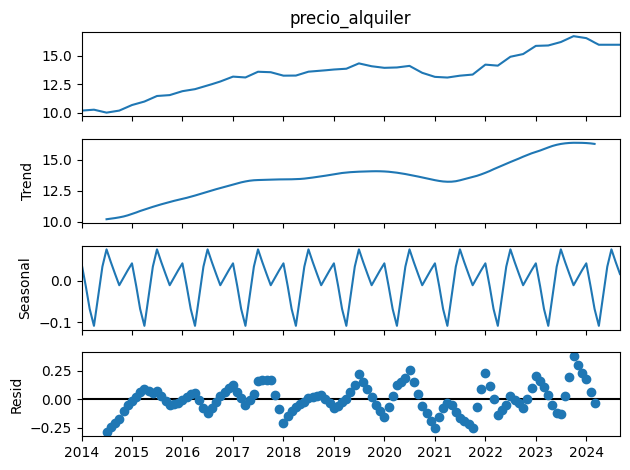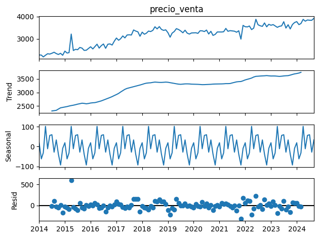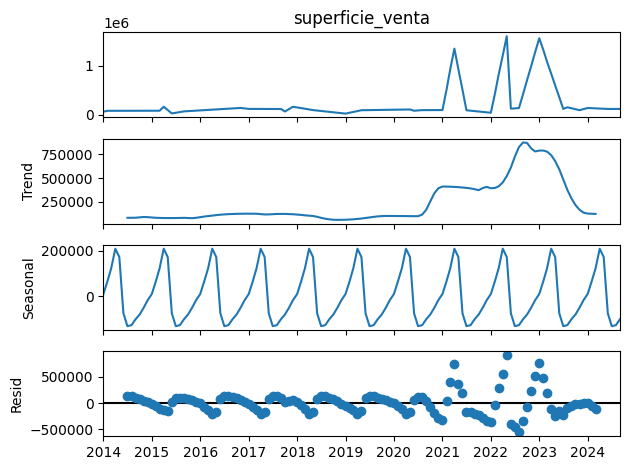

      - El mercado de alquiler sigue una tendencia de crecimiento a largo plazo, con fluctuaciones estacionales bien definidas.
      - Las ligeras irregularidades en los residuos sugieren que hay factores adicionales que podrían influir en los precios pero que no siguen patrones sistemáticos.
      - El precio de venta muestra un crecimiento sostenido a largo plazo, con patrones estacionales bien definidos.
      - Los residuos y puntos atípicos pueden estar vinculados a cambios en políticas económicas, fluctuaciones de mercado, o eventos globales, como la pandemia en 2020.
---

   2. **Análisis Exploratorio de Datos (EDA)**: Identificar patrones, anomalías y relaciones entre las variables mediante visualizaciones y estadísticas descriptivas.

      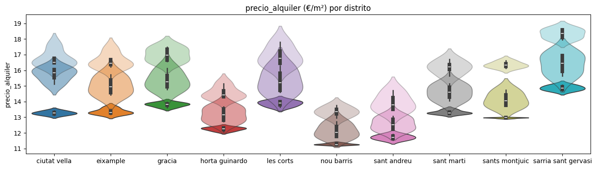
---

   3. **Análisis de Calidad de los Datos**: Evaluar la calidad de los datos, identificando problemas como valores faltantes, inconsistencias, errores o duplicados.

      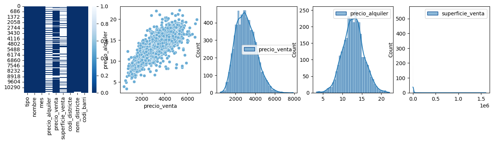

      1. **Columnas con Mayor Cantidad de Datos Nulos:**
         * **precio_alquiler:** Presenta una gran cantidad de datos faltantes, lo que sugiere que muchos registros no tienen información sobre el precio de alquiler.
         * **precio_venta:** También muestra una cantidad significativa de datos nulos, indicando que el precio de venta no está registrado en muchos casos.
         * **superficie_venta:** Al igual que las anteriores, esta columna presenta muchos valores faltantes, lo que podría indicar que no se dispone de información sobre la superficie de venta en muchos inmuebles.

---

   4. **Análisis Gráfico de los Datos**: Representar gráficamente las variables mediante gráficos como histogramas, diagramas de dispersión, boxplots, entre otros, para facilitar la comprensión visual de los datos.

      

      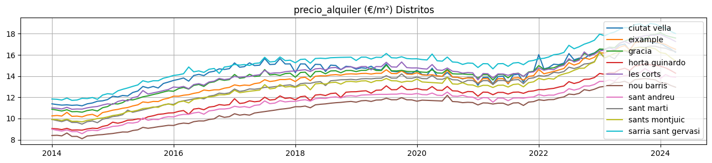

      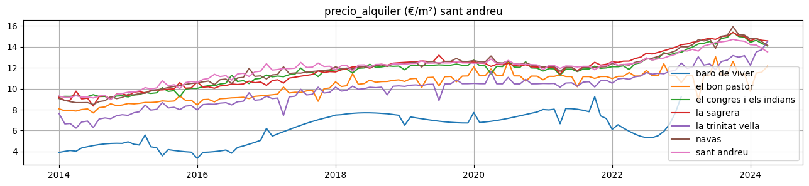

      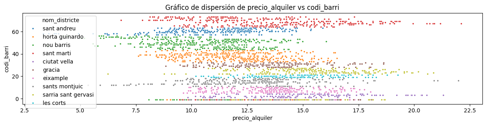

      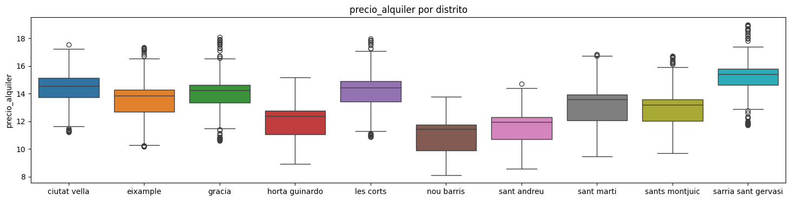

---
   5. **Segmentación Inteligente de los Datos**: Implementar técnicas de segmentación avanzadas que aporten valor al análisis y la extracción de insights relevantes.

      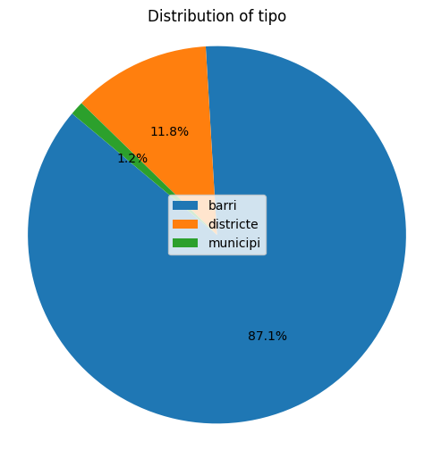 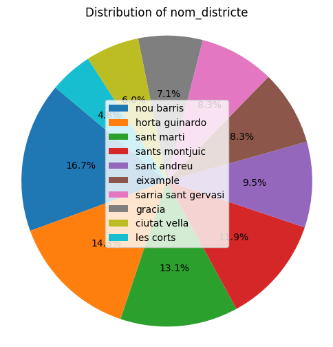
      
      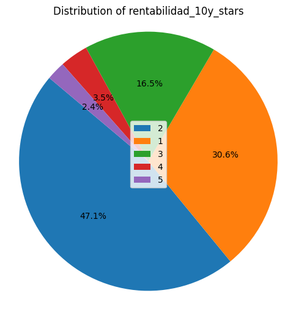 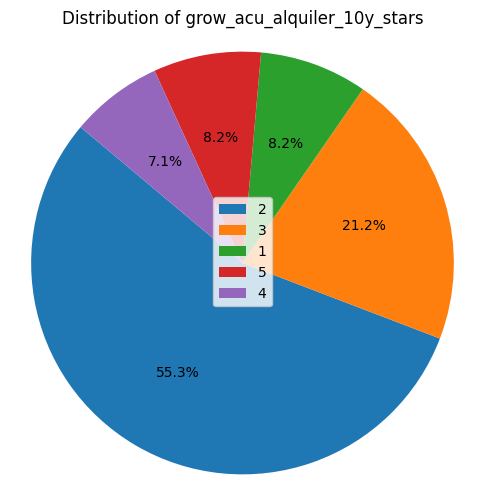 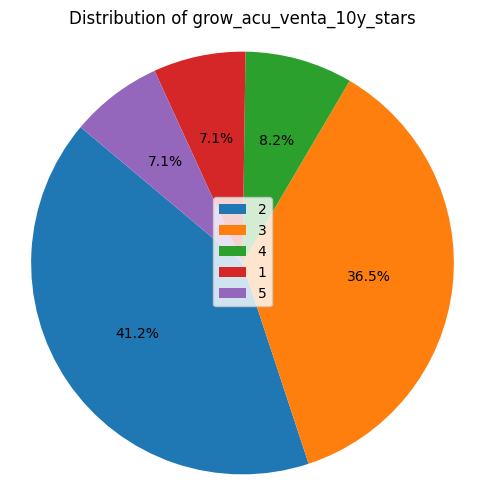 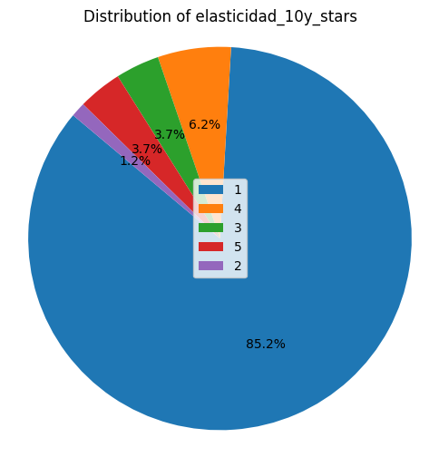

---
   6. **Análisis de Correlación**: Evaluar las relaciones y asociaciones entre las variables mediante matrices de correlación y análisis de dependencias.

      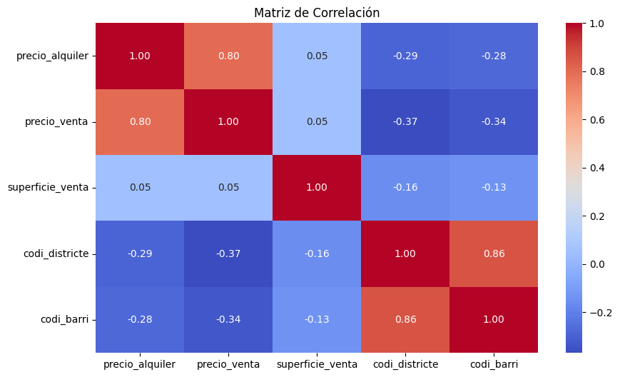

      1. **Relación fuerte entre `precio_alquiler` y `precio_venta`**:
         - Existe una correlación positiva alta (0.80), lo que indica que cuando el precio de alquiler aumenta, también tiende a aumentar el precio de venta. Esto sugiere una relación directa entre estos dos mercados.

      2. **Baja correlación entre `superficie_venta` y las demás variables**:
         - `superficie_venta` no muestra una correlación significativa con ninguna de las otras variables (valores cercanos a 0). Esto podría implicar que el tamaño no es un factor determinante en las variaciones de precio o que otros factores influyen más.

      3. **Relaciones negativas con `codi_districte` y `codi_barri`**:
         - Las variables `codi_districte` y `codi_barri` tienen correlaciones negativas con los precios (`precio_alquiler` y `precio_venta`), lo que podría reflejar diferencias geográficas: en ciertos distritos o barrios, los precios tienden a ser más bajos.

      4. **Alta correlación entre `codi_districte` y `codi_barri` (0.86)**:
         - Esto es lógico, ya que ambos códigos están relacionados jerárquicamente (barrios están dentro de distritos).

      ### Interpretación
      - La relación entre precios de alquiler y venta es clave para entender cómo se comportan estos mercados de forma conjunta.
      - La superficie parece no ser tan determinante, pero podría ser útil segmentar el análisis para evaluar relaciones específicas en ciertos barrios o distritos.
      - Las correlaciones con los códigos geográficos reflejan posibles patrones espaciales, que podrían analizarse más a fondo para identificar zonas con características particulares en los precios.


      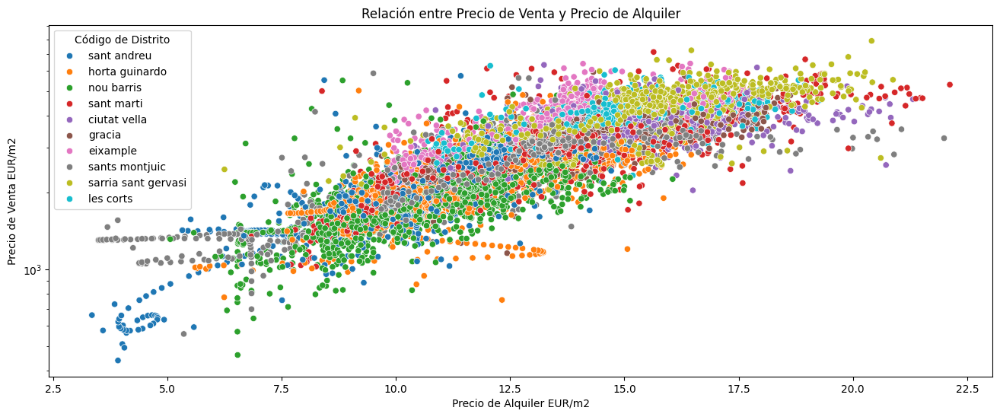

---

   7. **Análisis de Outliers**: Detectar y tratar los valores atípicos (outliers) presentes en los datos para mejorar la precisión de los modelos.

      

      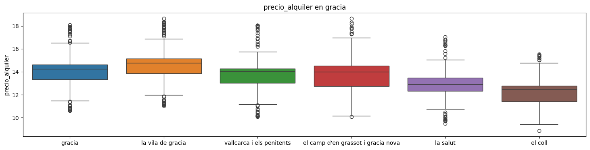

      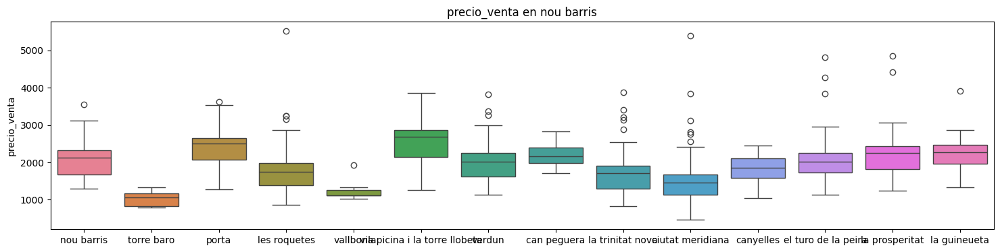

---
   8. **Análisis de Cohortes Avanzados**: Realizar segmentación y análisis del comportamiento de los usuarios a lo largo del tiempo, con el objetivo de identificar patrones de retención, uso y otros comportamientos clave.

      ### **Definición de las cohortes por métricas financieras**

      #### **1. Cohorte: Clase de Elasticidad del precio de compra medio en los últimos 10 años (`elasticidad_10y_stars`)**
      - **Definición**: 
      Esta cohorte clasifica los barrios en 5 clases según el cuartil de elasticidad del precio de compra medio. La elasticidad mide cómo responde el precio de compra de las viviendas a cambios en factores externos, como el nivel de ingresos, la oferta y demanda, o los cambios económicos. 
      - Barrios con elasticidad alta: Responden significativamente a las fluctuaciones del mercado.
      - Barrios con elasticidad baja: Presentan precios más estables.

      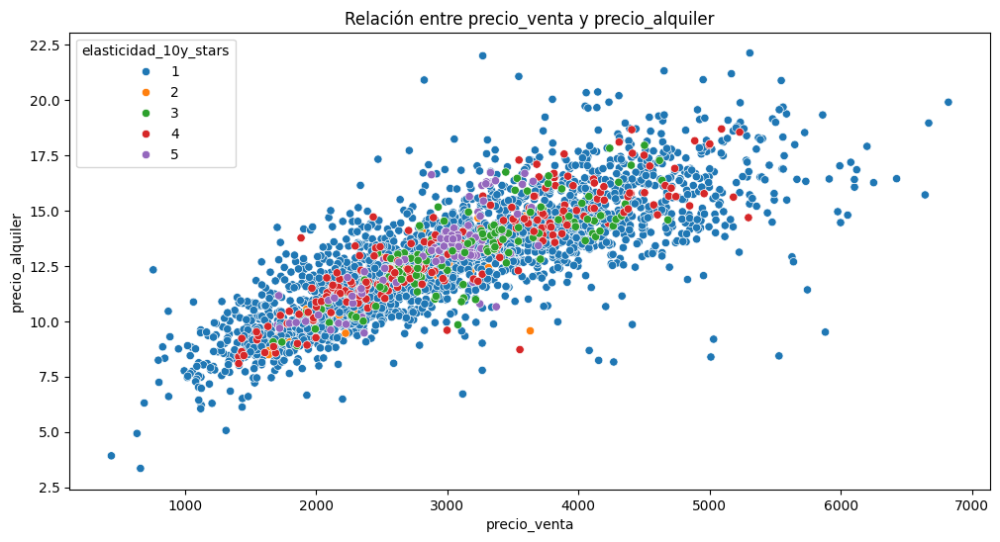

      - **Utilidad**: 
      - Identificar barrios con mayor volatilidad para inversores con mayor tolerancia al riesgo.
      - Detectar zonas con precios estables para inversiones conservadoras.
      - Analizar la sensibilidad de los barrios a cambios macroeconómicos, ayudando a prever posibles riesgos o ventajas en futuros escenarios.

      ---

      #### **2. Cohorte: Clase de Rentabilidad de inversión media en los últimos 10 años (`rentabilidad_10y_stars`)**
      - **Definición**: 
      Clasifica los barrios en 5 clases basándose en el cuartil de rentabilidad media (bruta o neta) generada por la inversión en propiedades en los últimos 10 años. La rentabilidad mide el retorno económico generado, comparando ingresos por alquiler o revalorización con el coste inicial de la inversión.

      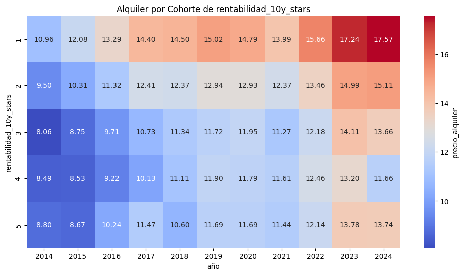

      - **Utilidad**:
      - Identificar los barrios más rentables para maximizar el retorno económico.
      - Comparar la relación entre rentabilidad y riesgo (elasticidad o estabilidad de precios).
      - Evaluar la sostenibilidad de rentabilidades pasadas en el contexto actual del mercado inmobiliario.
      - Segmentar inversores según su enfoque (rentabilidad a corto plazo vs. revalorización a largo plazo).

      ---

      #### **3. Cohorte: Clase de Crecimiento acumulado del precio de alquiler medio en los últimos 10 años (`grow_acu_alquiler_10y_stars`)**
      - **Definición**: 
      Esta cohorte clasifica los barrios en 5 clases según el cuartil de crecimiento acumulado en el precio medio del m² de alquiler en la última década. El crecimiento acumulado refleja la capacidad del barrio para atraer demanda y adaptarse a cambios en el mercado de alquiler.

      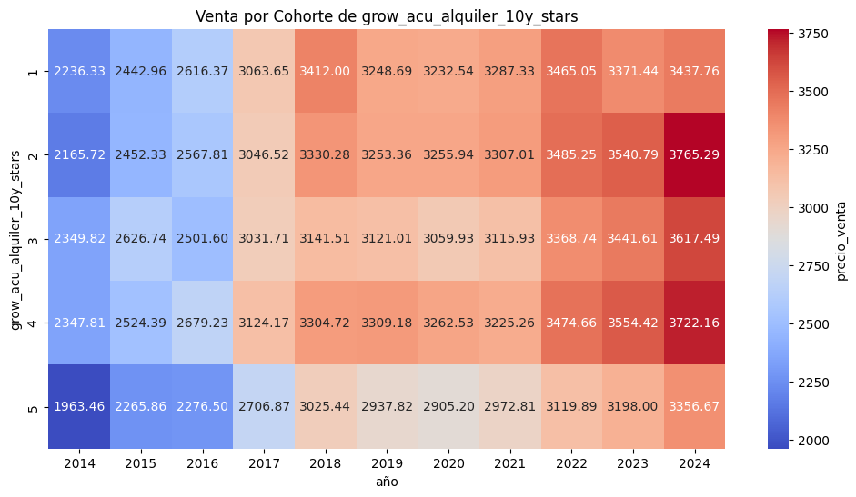

      - **Utilidad**:
      - Identificar barrios con alta demanda de alquiler (zonas emergentes o consolidadas).
      - Evaluar oportunidades para inversión en alquiler basándose en tendencias históricas.
      - Analizar la relación entre el crecimiento del alquiler y otros indicadores (ingresos de la población, nuevas infraestructuras, etc.).
      - Diseñar estrategias de marketing o posicionamiento para propiedades en zonas de rápido crecimiento.

      ---

      #### **4. Cohorte: Clase de Crecimiento acumulado del precio de compra medio en los últimos 10 años (`grow_acu_venta_10y_stars`)**
      - **Definición**: 
      Clasifica los barrios en 5 clases basándose en el cuartil de crecimiento acumulado en el precio medio del m² de venta en los últimos 10 años. Representa la capacidad de revalorización de las propiedades en cada barrio.

      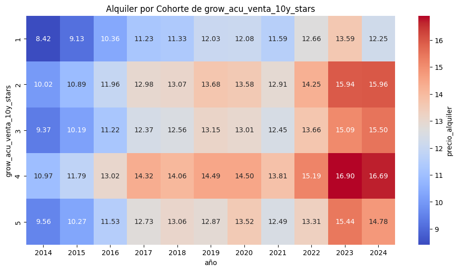

      - **Utilidad**:
      - Identificar barrios con alta revalorización para inversiones a largo plazo.
      - Detectar áreas en declive o con crecimiento moderado, que puedan representar oportunidades de compra a precios reducidos.
      - Evaluar la correlación entre el crecimiento del precio de venta y factores como la calidad de vida, inversiones en infraestructuras o evolución socioeconómica de la zona.
      - Prever el impacto de nuevas normativas o cambios en la dinámica del mercado en el crecimiento futuro.

      ---

      ### **Insights relevantes que se pueden extraer**
      1. **Análisis de rentabilidad vs. riesgo**: 
         Comparando `elasticidad_10y_stars` con `rentabilidad_10y_stars`, es posible identificar barrios con rentabilidad alta pero riesgo bajo (ideal para inversiones conservadoras) o barrios de alta elasticidad y alta rentabilidad (para inversores agresivos).

      2. **Oportunidades de crecimiento**: 
         Relacionando `grow_acu_alquiler_10y_stars` y `grow_acu_venta_10y_stars`, se pueden identificar áreas con alta demanda de alquiler y revalorización de propiedades, óptimas para inversiones mixtas (compra para alquilar y reventa).

      3. **Estrategias específicas por perfil de inversor**: 
         - **Inversores a corto plazo**: Priorizar barrios con alta rentabilidad y elasticidad moderada.
         - **Inversores a largo plazo**: Enfocarse en zonas con alto crecimiento acumulado en venta y estabilidad de precios.

      4. **Identificación de zonas emergentes**:
         Comparando `grow_acu_alquiler_10y_stars` y `elasticidad_10y_stars`, se pueden detectar barrios con demanda creciente y precios aún moderados, indicando potencial para revalorización futura.

      5. **Impacto de factores externos**:
         Analizando cómo la elasticidad varía entre barrios, es posible prever qué áreas serán más sensibles a cambios en normativas, tasas de interés o dinámica de oferta/demanda.

      6. **Clasificación competitiva de barrios**: 
         Usando las cohortes como base, es posible elaborar rankings de barrios para orientar a inversores o agentes inmobiliarios.

      ### **Conclusión**
      Estas cohortes permiten segmentar el mercado inmobiliario de forma avanzada, ofreciendo insights útiles para optimizar decisiones de inversión, diseño de políticas públicas o estrategias comerciales. Su combinación potencia el análisis multidimensional, ajustado a distintos perfiles y objetivos. 

      ---

      ### **Descripción de la cohorte `cohortes_distrito`**

      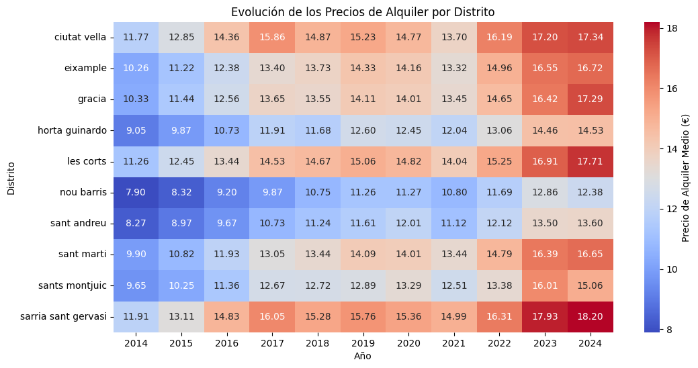

      La cohorte `cohortes_distrito` se genera a partir de los datos del dataset agrupados por **distrito** (`codi_districte`) y **año** (`año`), con el objetivo de analizar las tendencias de los precios de alquiler y venta en diferentes distritos de Barcelona a lo largo del tiempo.

      #### **Estructura de la cohorte `cohortes_distrito`**

      1. **Identificador de cohorte**: La cohorte se define como la combinación del `codi_districte` (que representa el distrito de la ciudad) y el `año` de la fecha del dato (`mes` transformado en año). Así, cada fila del DataFrame representa un distrito y el año de las mediciones de precios, lo que permite observar cómo han evolucionado los precios de alquiler y venta en ese distrito a lo largo del tiempo.
         
         - **Cohorte**: `cohorte_distrito = codi_districte + '-' + año`

      2. **Variables principales**:
         - **`alquiler_medio`**: Precio medio de alquiler en ese distrito y año.
         - **`venta_media`**: Precio medio de venta en ese distrito y año.
         - **`codi_districte`**: Código del distrito, que se usa para identificar el área específica de Barcelona.
         - **`año`**: El año de la medición, extraído de la columna `mes`.

      ### **Insights relevantes que se pueden extraer de la cohorte `cohortes_distrito`**

      1. **Análisis geográfico a nivel distrital**:
         - **Diferencias regionales**: Los distritos de Barcelona suelen presentar características socioeconómicas distintas. Algunos pueden ser más turísticos, otros más residenciales o comerciales, lo que afecta tanto a la oferta como a la demanda de propiedades. Al crear una cohorte basada en el distrito y año, se puede observar cómo evoluciona el mercado de precios en diferentes áreas de la ciudad.
         - **Estabilidad local**: El análisis de los precios por distrito permite observar si ciertas zonas experimentan una estabilidad o fluctuaciones a lo largo del tiempo, lo que puede ser valioso para inversores, planificadores urbanos y ciudadanos interesados en las tendencias inmobiliarias.

      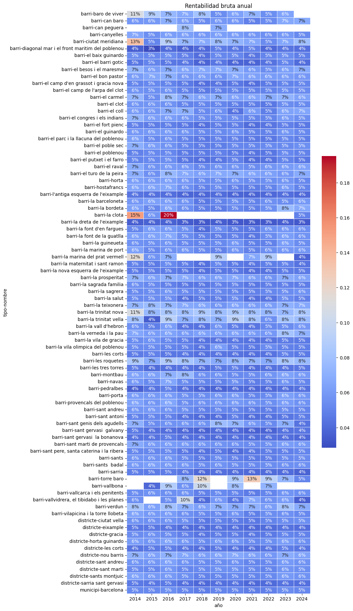
      
      2. **Evolución temporal de los precios**:
         - Al agrupar los datos por año, es posible identificar si los precios de alquiler y venta en un distrito aumentan, disminuyen o permanecen estables a lo largo del tiempo. Esto puede reflejar factores como la gentrificación, cambios en la infraestructura, o políticas urbanísticas locales.
         - **Estacionalidad**: Además de observar las tendencias anuales, esta cohorte podría ser útil para detectar patrones estacionales si se desglosara aún más en base a meses o trimestres.


      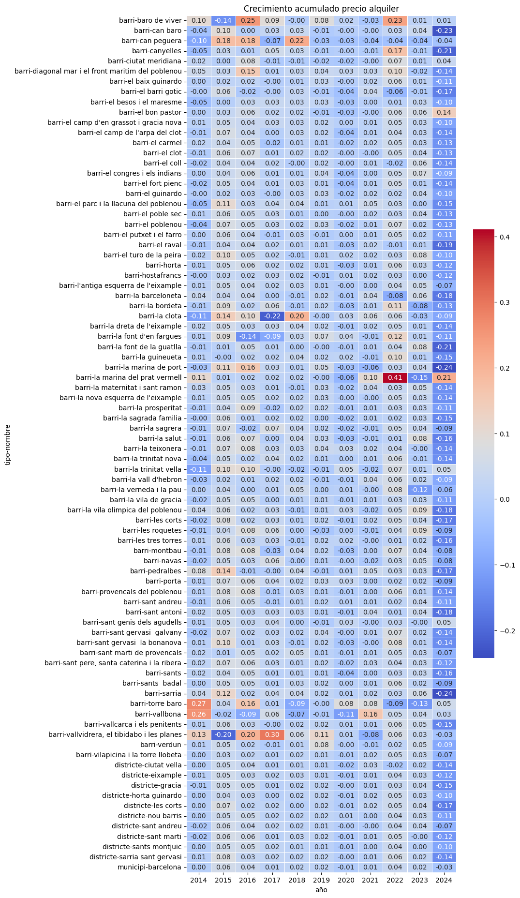


      3. **Impacto de factores externos**:
         - Las variaciones de los precios en los distritos podrían estar influenciadas por eventos o decisiones fuera del control de los individuos, como el desarrollo de infraestructuras, cambios en las leyes de arrendamiento, o proyectos urbanísticos. Esta cohorte ayuda a estudiar cómo esos factores afectan a cada distrito de manera distinta.

      4. **Segmentación para análisis detallados**:
         - La cohorte por distrito permite realizar un análisis más granular, lo que facilita la toma de decisiones específicas para cada zona. Por ejemplo, si un distrito muestra un aumento considerable en los precios, podría ser un indicativo de que la zona está siendo más demandada o que está pasando por un proceso de renovación o desarrollo.
         - Las políticas urbanísticas o el desarrollo económico podrían ser analizados en función de cómo afectan a los diferentes distritos. Si el distrito con un alto índice de precios sube significativamente, se podría investigar si el área está siendo renovada o si tiene un crecimiento económico.

      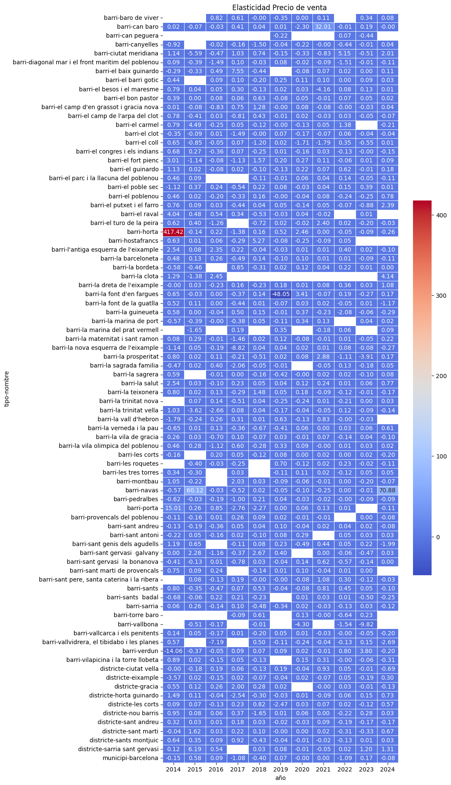

      ### **Conclusión**
      La cohorte `cohortes_distrito` es valiosa porque permite hacer un análisis detallado de la evolución de los precios inmobiliarios en Barcelona, proporcionando información útil tanto para analistas de datos como para los responsables de la toma de decisiones en planificación urbana, inversión inmobiliaria y desarrollo económico.


---

1. **Modelamiento**: Se desarrollarán modelos de aprendizaje automático (ML) para predecir la rentabilidad futura de una inversión inmobiliaria y el retorno sobre la inversión (ROI).

   9. **Modelos de Regresión Regularizados**: Implementar modelos de regresión regularizados (como Ridge, Lasso, ElasticNet), utilizando técnicas de búsqueda de hiperparámetros para optimizar el rendimiento del modelo.

      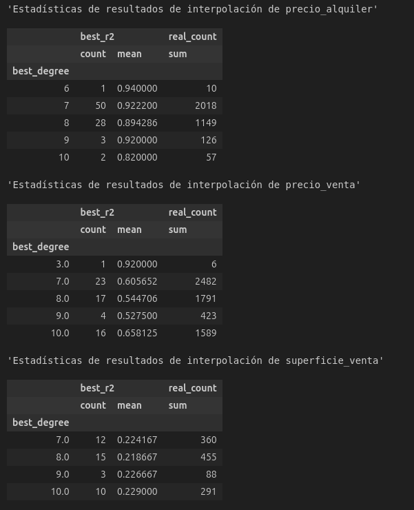


      **Extrapolación de Precios a 12 Meses Futuros**

      El objetivo principal de este proyecto es construir modelos predictivos que sean capaces de estimar los precios de alquiler en Barcelona para los próximos 12 meses. ¿Por qué hacemos esto?

      1.  **Visión a Futuro:** En el mundo real, tener una idea de cómo evolucionarán los precios es crucial para diversos actores:
         *   **Inquilinos:** Para planificar presupuestos y decisiones de mudanza.
         *   **Propietarios:** Para fijar precios competitivos y rentables.
         *   **Inversores:** Para identificar oportunidades de inversión inmobiliaria.
         *   **Administraciones:** Para diseñar políticas de vivienda y planes urbanísticos.
      2.  **Evaluación de Modelos:** Al extrapolar precios, no solo estamos prediciendo el futuro, sino que también estamos poniendo a prueba la robustez y la capacidad de generalización de nuestros modelos. ¿Qué tan bien se desempeñan al predecir datos que no han visto antes? ¿Cómo manejan la incertidumbre del futuro?
      3.  **Comparación de Enfoques:** Al utilizar diferentes modelos (Lineal, Random Forest, Gradient Boosting, MLP, ARIMA, Prophet, modelos básicos de Media y Último Valor), podemos evaluar cuál de ellos se adapta mejor a la dinámica de los datos de precios de alquiler. Algunos modelos podrían ser mejores para capturar tendencias lineales, otros para manejar no linealidades o patrones estacionales.

      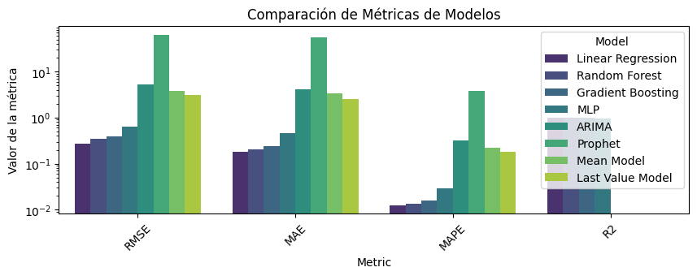


      **El Significado de Cada Métrica**

      En nuestro proyecto, hemos usado cuatro métricas principales para evaluar el rendimiento de nuestros modelos. Cada una tiene un enfoque distinto:

      1.  **RMSE (Raíz del Error Cuadrático Medio):**
      El RMSE mide la desviación promedio entre los precios predichos y los precios reales. Lo que hace es calcular la raíz cuadrada de la media de los errores al cuadrado.

      2.  **MAE (Error Absoluto Medio):**
      El MAE mide la desviación promedio entre los precios predichos y los precios reales, pero en lugar de elevar al cuadrado los errores utiliza el valor absoluto.

      3.  **MAPE (Error Porcentual Absoluto Medio):**
      El MAPE mide el error como un porcentaje. Calcula la diferencia absoluta entre los valores predichos y reales, luego divide por el valor real y lo expresa como porcentaje. Finalmente se calcula la media de estos porcentajes.

      4.  **R2 (Coeficiente de Determinación):**
      El R2 es una medida que indica qué proporción de la variabilidad de los precios de alquiler es explicada por nuestro modelo. El rango de esta métrica va entre 0 y 1.


   **Modelos de Machine Learning**

   Estos modelos se basan en aprender patrones a partir de los datos históricos para realizar predicciones.

   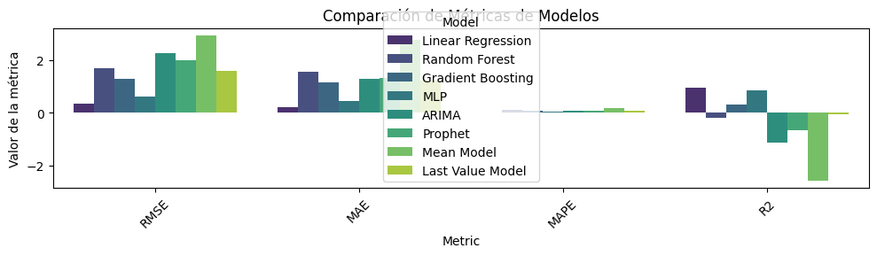

   1.  **Regresión Lineal:**
   Es el modelo más simple, donde se asume que existe una relación lineal entre las características y el precio del alquiler. Busca encontrar una línea recta que mejor se ajuste a los datos.

   2.  **Random Forest:**
   Es un modelo de "ensamble" que utiliza una multitud de árboles de decisión. Cada árbol se entrena con un subconjunto aleatorio de los datos y las características, y las predicciones de todos los árboles se promedian para obtener la predicción final.

   3.  **Gradient Boosting:**
   Es otro modelo de ensamble, que a diferencia de Random Forest construye los árboles de forma secuencial y cada nuevo árbol intenta corregir los errores del anterior.

   4.  **MLP (Red Neuronal Multicapa):**
   Es una red neuronal artificial con una o más capas ocultas. Los datos pasan a través de las capas, donde cada neurona aplica una transformación y aprende patrones complejos.

   **Modelos de Series Temporales**

   Estos modelos se diseñan específicamente para datos que cambian con el tiempo, como los precios de alquiler.

   5.  **ARIMA (Modelo Autorregresivo Integrado de Media Móvil):**
   Es un modelo lineal que predice valores futuros basándose en valores pasados. Utiliza componentes autorregresivos (AR), integrados (I) y de media móvil (MA) para capturar las dependencias temporales de los datos.


   6.  **Prophet:**
   Es un modelo desarrollado por Facebook específicamente para series temporales con estacionalidad y tendencias.

   **Modelos de Línea Base**

   Estos modelos son sencillos y sirven como referencia para evaluar la complejidad de los modelos más avanzados.

   7.  **Modelo de la Media Histórica:**
   Simplemente predice el valor de la variable objetivo utilizando la media de todos los valores de entrenamiento.

   8.  **Modelo del Último Valor:**
   Predice el valor de la variable objetivo usando el último valor del conjunto de entrenamiento.

   **En resumen:**

   *   **Diversidad de modelos:** Hemos incluido una variedad de modelos para evaluar cómo diferentes enfoques pueden funcionar en la predicción de precios de alquiler.
   *   **Exploración:** Probando estos modelos podemos observar como la complejidad, no linealidad y los patrones temporales pueden influir en la predicción de precios.
   *   **Comparación:** Utilizando todos los modelos con las métricas, podemos entender cual de ellos es el mejor para esta tarea, y obtener conocimientos muy valiosos para el futuro.


---

   10. **Modelos de Clasificación**: Desarrollar y optimizar modelos de clasificación (como árboles de decisión, SVM, k-NN), utilizando los métodos adecuados de validación y evaluación.

   **Modelos Utilizados**

   1.  **`CountVectorizer`:** Es un modelo de *vectorización de texto*. Su función es convertir texto en una matriz numérica de recuentos de palabras, que se utiliza como entrada para otros modelos.
   2.  **`TfidfTransformer`:** Es un modelo de *transformación de texto*. Convierte la salida del `CountVectorizer` en una matriz TF-IDF, que da más peso a palabras relevantes.
   3.  **`RandomForestClassifier`:** Es un *modelo de clasificación supervisado*. Su función es aprender patrones de los datos de entrenamiento y predecir la etiqueta de clase (disponibilidad) para nuevos datos.


   El código crea un pipeline que transforma texto en una representación numérica, la cual utiliza para entrenar un modelo de *Random Forest* para clasificar la "disponibilidad" basándose en la descripción textual de un inmueble.
   
   El proceso se realiza en los siguientes pasos:

   1.  **Preparación de datos:** Los datos se dividen en conjuntos de entrenamiento y prueba para evaluar el rendimiento del modelo en datos no vistos.
   
   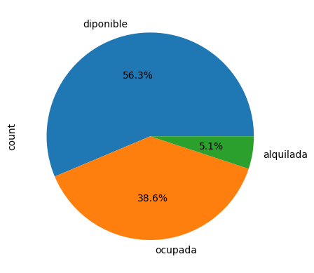


   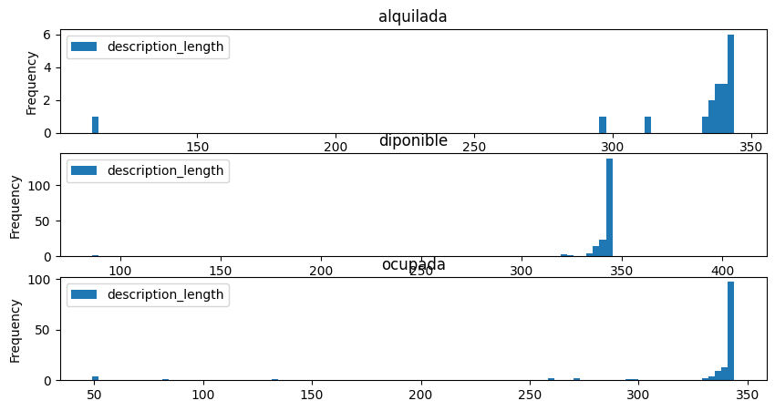
   
   2.  **Definición de un pipeline de procesamiento de texto:**
      *   **Vectorización:** Los textos se transforman en una matriz numérica utilizando `CountVectorizer`, que cuenta la frecuencia de las palabras. Se especifica una función `process_text` que se ejecuta antes del conteo de palabras para realizar un preprocesamiento del texto (como eliminación de ruido, stemming, etc.).
      *   **Transformación TF-IDF:** La matriz de frecuencia de palabras se convierte a una representación TF-IDF (`TfidfTransformer`), donde a cada palabra se le asigna un peso que indica su relevancia en un documento concreto, reduciendo la importancia de las palabras que aparecen en todos los documentos.
      *   **Clasificación:** Se utiliza un `RandomForestClassifier` para entrenar un modelo de clasificación basado en las representaciones numéricas del texto.
   3.  **Entrenamiento del modelo:** El pipeline se entrena con el conjunto de entrenamiento para ajustar los parámetros de la vectorización, la transformación y el clasificador.
   4.  **Predicción con el modelo:** Se realiza la predicción de las etiquetas de disponibilidad en el conjunto de prueba con el modelo ya entrenado.
   5.  **Evaluación del modelo:** Se genera un reporte de clasificación con métricas como precisión, recall, F1-score y soporte, para evaluar el rendimiento del modelo en cada clase.

   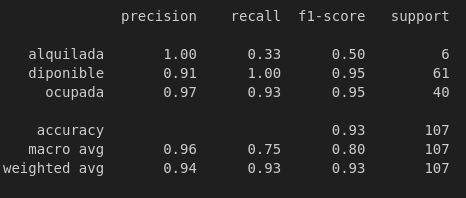

   **Interpretación General del Reporte**

   *   El modelo tiene un buen rendimiento general, con una exactitud del 93%.
   *   La clase `diponible` tiene un excelente rendimiento, tanto en precision como en recall.
   *   La clase `ocupada` también tiene un buen rendimiento.
   *   La clase `alquilada` tiene un rendimiento pobre en cuanto al recall, aunque su precisión sea perfecta. El modelo es muy preciso al predecir que una instancia es de tipo alquilada, pero no es capaz de encontrar todas las instancias de este tipo, es decir, no detecta todas las que realmente son alquiladas. Esto podría indicar que tu modelo tiene dificultades para identificar esta clase, y puede que necesites más datos o un modelo más complejo para la misma.
   *   Los promedios ponderados son útiles para evaluar el rendimiento general, especialmente cuando hay desbalance en las clases, y el f1-score ponderado de 0.93 indica un buen balance general de precision y recall.


   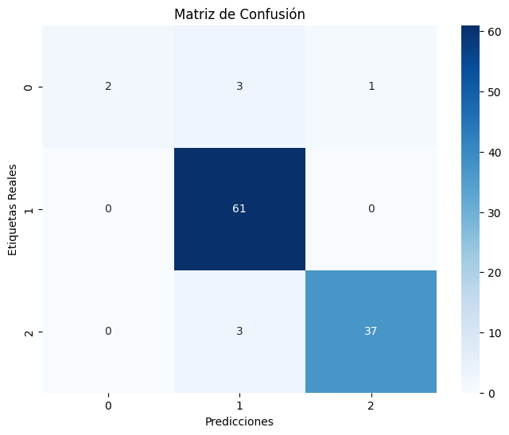
   

---
   11. **Validación de Modelos**: Seleccionar los mejores modelos mediante validación cruzada con k-fold, para asegurar la robustez y generalización de los modelos creados.

   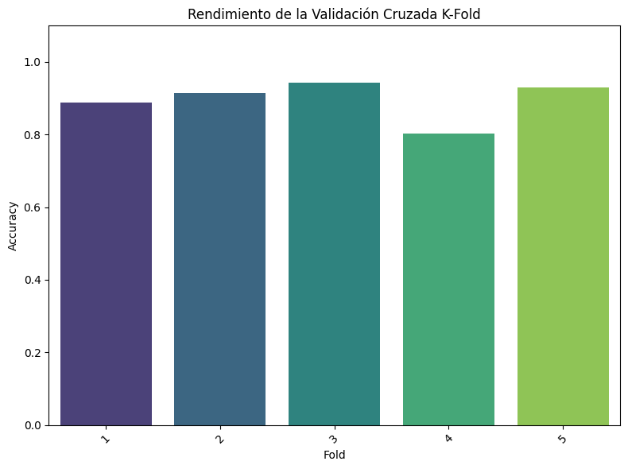

   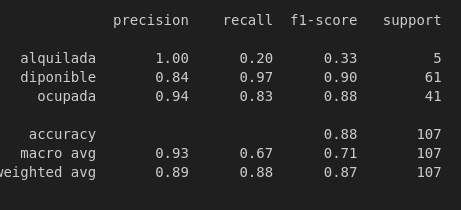
---

1. **Desarrollo**: Se desarrollarán un sistema de recuperación de información y recomendación de inversiones inmobiliarias basado en los modelos desarrollados.

   12. **Uso de Scraping para Variables Exógenas**: El proyecto debe incluir el uso de técnicas de web scraping para obtener variables adicionales de fuentes externas que aporten valor a los datos originales del proyecto.
         - Scrapping de una web para extraer datos del inmueble necesarios para realizar la valoración de la inversión
   - Generación del informe de valoración de la inversión del inmueble
