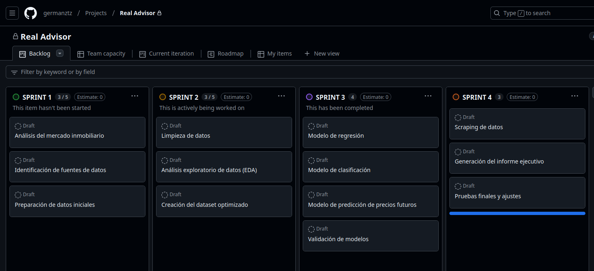

# Planificación de RealAdvisor - Trabajo de Final de Módulo

## Introducción

El objetivo principal del trabajo es desarrollar un sistema **recomendador de inversiones** en el sector inmobiliario. En el ámbito terrorial de la **provincia de Barcelona**.

El sistema solicitará al usuario una serie de datos para realizar el análisis, como:
- Datos o URL del imnueble (precio de compra, m2, ubicación)
- Otras características del inmueble (número de habitaciones, superficie, etc.) **(fuera del alcance)**

El sistema podrá estimar el importe de alquiler de esa vivienda teniendo en cuenta el municipio, la superficie y demás características del inmueble
Como resultado, el sistema devolverá un informe comercial del inmuebles analizado según el riesgo y la rentabilidad estimada y otros factores.

## Planificación

### **SPRINT 1: Investigación**
#### Subtareas:
1. **Análisis del mercado inmobiliario**  
   - Identificar tendencias de precios y patrones en la provincia de Barcelona.  
   - Relacionado con: **(1) Análisis de Series de Tiempo**.  

2. **Identificación de fuentes de datos**  
   - Investigar fuentes confiables de datos inmobiliarios.  
   - No aplica directamente a los requisitos, pero sienta la base para los análisis posteriores.  

3. **Preparación de datos iniciales**  
   - Descargar muestras de datos para evaluación.  
   - Identificar problemas básicos de calidad en los datos.  
   - Relacionado con: **(3) Análisis de Calidad de los Datos**.

---

### **SPRINT 2: Análisis de Datos**
#### Subtareas:
1. **Limpieza de datos**  
   - Detectar y tratar valores faltantes, inconsistencias y outliers.  
   - Relacionado con:  
     - **(3) Análisis de Calidad de los Datos**.  
     - **(7) Análisis de Outliers**.  

2. **Análisis exploratorio de datos (EDA)**  
   - Visualizar patrones mediante gráficos y tablas descriptivas (e.g., histogramas, boxplots).  
   - Relacionado con:  
     - **(2) Análisis Exploratorio de Datos (EDA)**.  
     - **(4) Análisis Gráfico de los Datos**.  

3. **Creación del dataset optimizado**  
   - Integrar y segmentar los datos por características relevantes.  
   - Relacionado con:  
     - **(5) Segmentación Inteligente de los Datos**.  
     - **(6) Análisis de Correlación**.  

---

### **SPRINT 3: Modelamiento**
#### Subtareas:
1. **Modelo de regresión**  
   - Implementar modelos de regresión regularizados para interpolar precios faltantes.  
   - Relacionado con:  
     - **(9) Modelos de Regresión Regularizados**.  

2. **Modelo de clasificación**  
   - Desarrollar un modelo para predecir la ocupación del inmueble.  
   - Relacionado con:  
     - **(10) Modelos de Clasificación**.  

3. **Modelo de predicción de precios futuros**  
   - Implementar análisis de series de tiempo para extrapolación de precios (e.g., ARIMA).  
   - Relacionado con:  
     - **(1) Análisis de Series de Tiempo**.  

4. **Validación de modelos**  
   - Utilizar validación cruzada (k-fold) para evaluar y seleccionar los mejores modelos.  
   - Relacionado con: **(11) Validación de Modelos**.  

---

### **SPRINT 4: Desarrollo**
#### Subtareas:
1. **Scraping de datos**  
   - Obtener variables exógenas de portales inmobiliarios mediante técnicas de scraping.  
   - Relacionado con: **(12) Uso de Scraping para Variables Exógenas**.  

2. **Generación del informe ejecutivo**  
   - Presentar análisis de cohorte para mostrar patrones clave en los datos de inversión.  
   - Relacionado con: **(8) Análisis de Cohortes Avanzados**.  

3. **Pruebas finales y ajustes**  
   - Validar la funcionalidad del sistema y corregir errores en los informes generados.  
   - Relacionado con: **(11) Validación de Modelos** (comprobación final).  

